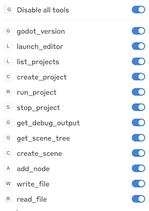
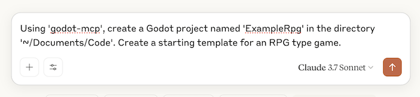

# Godot MCP Server (GMS)

A basic Model Context Protocol (MCP) server for the Godot game engine that enables AI assistants to interact with and manipulate Godot projects.
 This server, in general, uses the [Godot command line](https://docs.godotengine.org/en/stable/tutorials/editor/command_line_tutorial.html) to work with projects, so no Godot plugins are needed.

## Table of Contents
- [Overview](#overview)
- [Setup](#setup)
- [Usage](#usage)
- [Available Tools](#available-tools)
- [Architecture](#architecture)
- [How It Works](#how-it-works)
- [Development](#development)
- [Example using Claude Desktop - Mac](#example-using-claude-desktop---mac)
- [License](#license)

## Overview

The GMS provides a bridge between AI assistants (like Claude) and the Godot game engine. It allows AI models to:

- Create and manage Godot projects
- Launch the Godot editor
- Run Godot projects
- Manipulate scenes and nodes
- Read and write files

This server implements the [Model Context Protocol](https://github.com/anthropics/model-context-protocol) (MCP), which standardizes how AI assistants interact with external tools and services.

## Setup

### Prerequisites

- [Node.js](https://nodejs.org/) (v14 or higher)
- [Godot Engine](https://godotengine.org/) (v4.x recommended)

### Installation

1. Clone this repository:
   ```bash
   git clone https://github.com/matula/godot-mcp-server.git
   cd godot-mcp-server
   ```

2. Install dependencies:
   ```bash
   npm install
   ```

3. Build the project:
   ```bash
   npm run build
   ```

### Configuration

The server will automatically try to locate your Godot command line executable. If it can't find it, you can set the `GODOT_PATH` environment variable to the path of your Godot executable:

```bash
export GODOT_PATH=/path/to/your/godot
```

On different platforms, the server looks for Godot in these default locations:

- **macOS**: 
  - `/Applications/Godot.app/Contents/MacOS/Godot`
  - `/Applications/Godot_4.app/Contents/MacOS/Godot`
  - `/Applications/Godot_4.2.app/Contents/MacOS/Godot`

- **Linux**:
  - `/usr/bin/godot`
  - `/usr/local/bin/godot`

- **Windows**:
  - `C:\Program Files\Godot\Godot.exe`
  - `C:\Program Files (x86)\Godot\Godot.exe`

## Usage

### Starting the Server

```bash
npm start
```

Or in development mode:

```bash
npm run dev
```

### Using with MCP Inspector

You can test the server with the MCP Inspector:

```bash
npm run inspector
```

### Using with Claude Desktop

You can integrate the GMS with Claude Desktop by adding it to the Claude Desktop configuration:

1. Locate the Claude Desktop configuration file:
   - Generally on macOS: `/Users/{username}/Library/Application Support/Claude/claude_desktop_config.json`

2. Add the following configuration to the file:

```json
{
  "mcpServers": {
    "godot-mcp": {
      "command": "node",
      "args": ["{full path to mcp}/godot-mcp-server/build/index.js"],
      "env": {
        "MCP_TRANSPORT": "stdio"
      }
    }
  }
}
```

**Notes:**
- If the configuration file already contains an `mcpServers` object, add the `godot-mcp` entry to the existing object.
- Replace `{full path to mcp}` with the actual path to where you cloned the repository.
- You may need to use the complete path to the `node` executable if it's not in your system PATH.

## Available Tools

The GMS provides the following tools:

### Godot Tools

- **godot_version**: Get the installed Godot version
- **launch_editor**: Launch the Godot editor for a project
- **list_projects**: List Godot projects in a directory
- **create_project**: Create a new Godot project (3D, 2D, or empty)
- **run_project**: Run a Godot project
- **stop_project**: Stop a running project
- **get_debug_output**: Get debug output from a running project
- **get_scene_tree**: Get the scene tree from a project
- **create_scene**: Create a new scene in a project
- **add_node**: Add a node to a scene

### File Tools

- **write_file**: Write content to a file
- **read_file**: Read content from a file

## Architecture

The GMS is built with a modular architecture:

1. **MCP Server Core**: Uses the `@modelcontextprotocol/sdk` to create a server that communicates with AI assistants.

2. **Tools Registration**: Tools are registered with the MCP server to expose functionality to AI assistants.

3. **Godot Integration**: The server interacts with Godot in three main ways:
   - **Commands**: Direct execution of Godot commands via command-line interface
   - **Operations**: Complex operations executed through GDScript
   - **Utilities**: Helper functions for finding Godot, running commands, etc.

4. **File Operations**: Basic file I/O operations to read and write files.

## How It Works

1. The server starts and registers all available tools with the MCP framework.
2. It connects to the standard input/output for communication with AI assistants.
3. When a tool is invoked:
   - For simple commands, it executes Godot with appropriate command-line arguments
   - For complex operations, it creates a temporary GDScript file and executes it with Godot
   - The results are returned to the AI assistant in a structured format

## Development

### Project Structure

- `src/index.ts`: Main entry point
- `src/godot/commands.ts`: Basic Godot commands
- `src/godot/operations.ts`: Complex Godot operations using GDScript
- `src/tools/godot-tools.ts`: MCP tool definitions for Godot
- `src/tools/file-tools.ts`: MCP tool definitions for file operations
- `src/utils/godot-utils.ts`: Utility functions for Godot integration

### Building

```bash
npm run build
```

## Example using Claude Desktop - Mac

In the tools, you should see the active MCP:



Here's an example prompt:



If you're interested, [here's the full code](https://github.com/matula/example-godot-rpg) that was created with that prompt. I tried to run it 
and there were errors, but it looks fixable.

## License

ISC License
